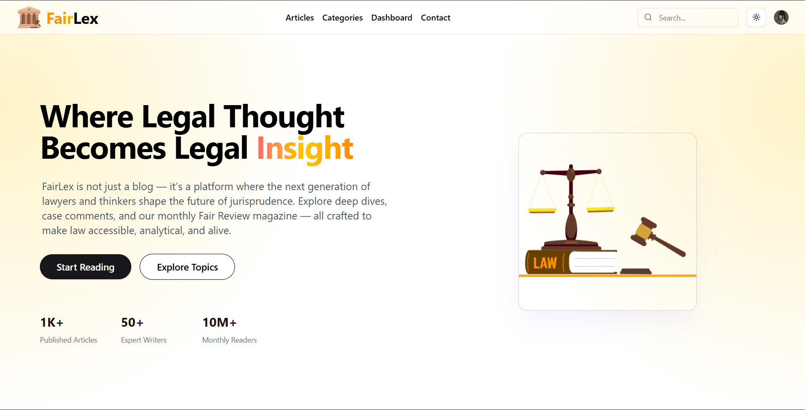
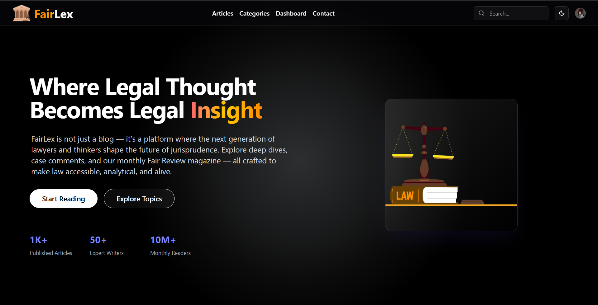
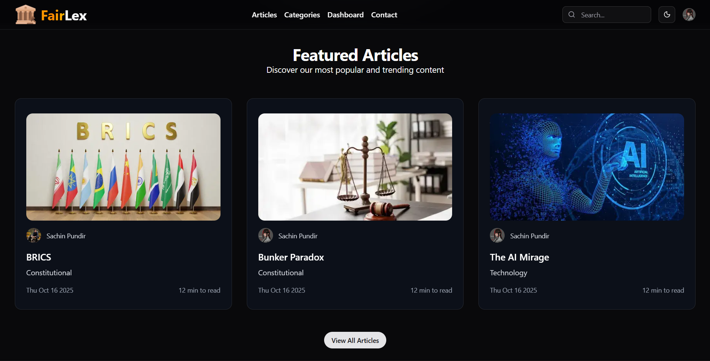
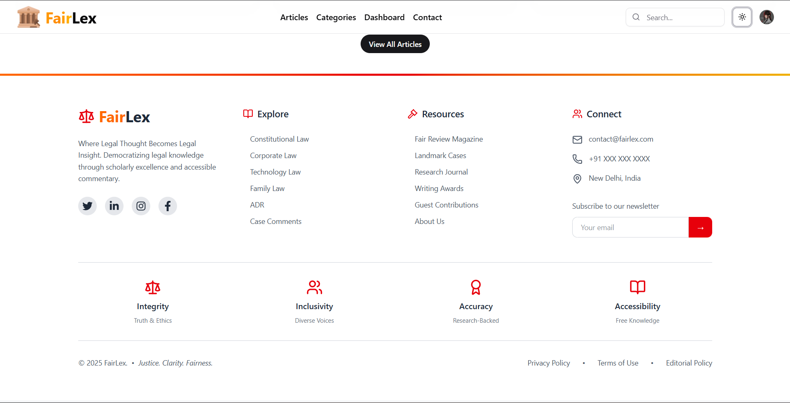
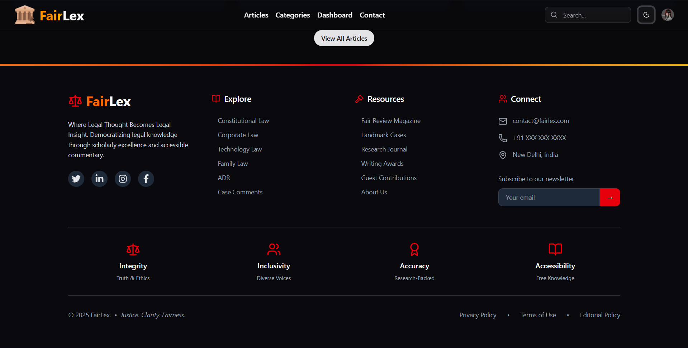
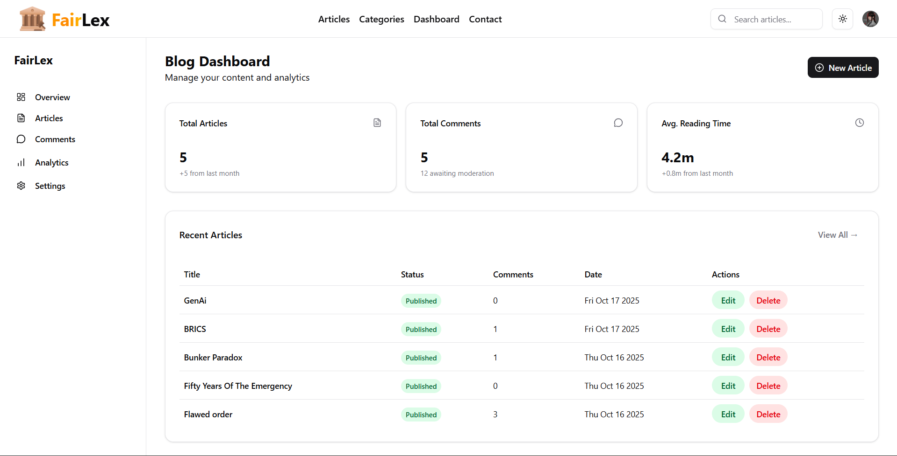
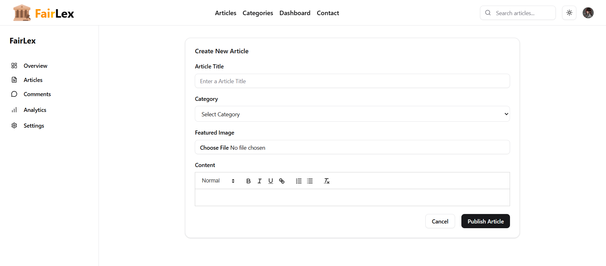
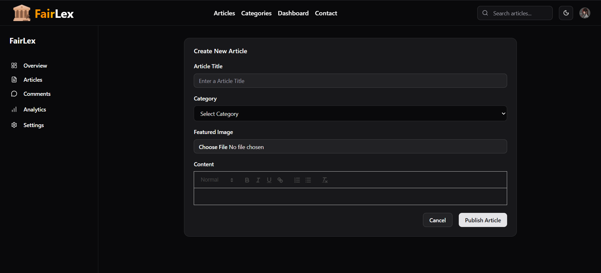

# ⚖️ FairLex – Legal Blogging Platform  

> _Where Law Meets Fairness_  
A modern web application built with **Next.js 15**, **React**, **TypeScript**, **Prisma**, **PostgreSQL**, **Clerk**, and **Cloudinary** — delivering a seamless and secure blogging experience for the legal community.

---

## 🌐 Tech Stack  

| Technology | Description |
|-------------|-------------|
| ⚡ **Next.js 15** | Modern React framework for server-side rendering and routing |
| ⚛️ **React** | UI library for building interactive components |
| 🧠 **TypeScript** | Type-safe JavaScript for reliable and maintainable code |
| 🗃️ **Prisma** | Next-gen ORM for database schema and queries |
| 🐘 **PostgreSQL** | Robust relational database for structured legal content |
| 🔐 **Clerk** | Authentication and user management |
| ☁️ **Cloudinary** | Cloud-based image and media optimization |

---

## 🏗️ Folder Structure  

```
FairLex/
├── prisma/
│   ├── migrations/
│   └── schema.prisma
│
├── public/
│
├── src/
│   ├── actions/
│   │
│   ├── app/
│   │   ├── (auth)/
│   │   ├── (home)/
│   │   ├── about/
│   │   ├── articles/
│   │   ├── categories/
│   │   ├── contact/
│   │   ├── dashboard/
│   │   ├── fair-review/
│   │   ├── favicon.ico
│   │   ├── globals.css
│   │   └── layout.tsx
│   │
│   ├── components/
│   │   ├── about/
│   │   ├── articles/
│   │   ├── categories/
│   │   ├── comments/
│   │   ├── contact/
│   │   ├── dashboard/
│   │   ├── fair-review/
│   │   ├── home/
│   │   ├── ui/
│   │   └── theme-provider.tsx
│   │
│   ├── config/
│   │   └── categories.ts
│   │
│   ├── lib/
│   │   ├── query/
│   │   ├── prisma.ts
│   │   ├── utils.ts
│   │   └── middleware.ts
│   │
│   ├── types/
│   │   ├── globals.d.ts
│   │   └── roles.ts
│   │
│   └── middleware.ts
│
├── .env
├── .env.local
└── README.md

```

---

## 🖼️ Screenshots  

| Preview 1 | Preview 2 |
|------------|------------|
|  |  |
|  |  |
|  |  |
|  |  |
|  |  |

> 📷 _All UI screenshots of FairLex are stored inside the `/public` folder._

---

## 🧩 Features  

✅ Secure authentication via **Clerk**  
✅ Database management via **Prisma + PostgreSQL**  
✅ Media uploads with **Cloudinary**  
✅ Modern, responsive UI with **Next.js 15 + React**  
✅ Modular component structure  
✅ Blog posting, commenting, and dashboard system  

---

## 🚀 Getting Started  

### 1️⃣ Clone the repository
```bash
git clone https://github.com/your-username/fairlex.git
cd fairlex
```

### 2️⃣ Install dependencies
```bash
npm install
```

### 3️⃣ Configure Environment Variables  
Create a `.env` file with your credentials:
```
DATABASE_URL=your_postgresql_url

```

Create a `.env.local` file with your credentials:
```

NEXT_PUBLIC_CLERK_PUBLISHABLE_KEY=your_clerk_key
CLERK_SECRET_KEY=your_clerk_secret
CLOUDINARY_CLOUD_NAME=your_cloud_name
CLOUDINARY_API_KEY=your_api_key
CLOUDINARY_API_SECRET=your_cloudinary_api_key

```

### 4️⃣ Run the development server
```bash
npm run dev
```
Then visit 👉 **http://localhost:3000**

---

## 🧠 Vision & Mission  

> FairLex aims to democratize legal knowledge by connecting scholars, practitioners, and the public through credible, insightful legal discourse.

---

## 🪪 License  

```
MIT License  

Copyright (c) 2025 Sachin Pundir  

Permission is hereby granted, free of charge, to any person obtaining a copy  
of this software and associated documentation files (the "Software"), to deal  
in the Software without restriction, including without limitation the rights  
to use, copy, modify, merge, publish, distribute, sublicense, and/or sell  
copies of the Software, and to permit persons to whom the Software is  
furnished to do so, subject to the following conditions:  

THE SOFTWARE IS PROVIDED "AS IS", WITHOUT WARRANTY OF ANY KIND, EXPRESS OR  
IMPLIED, INCLUDING BUT NOT LIMITED TO THE WARRANTIES OF MERCHANTABILITY,  
FITNESS FOR A PARTICULAR PURPOSE AND NONINFRINGEMENT.
```

---

## ✨ Author  

👨‍💻 **Sachin Pundir**  
🌍 [https://portfolio-sachin-ruby.vercel.app/]  
📧 [sachinpundir732@example.com]

> “Justice. Clarity. Fairness.” – _FairLex_
